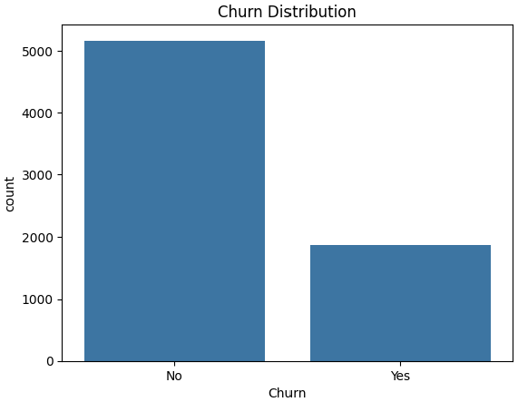
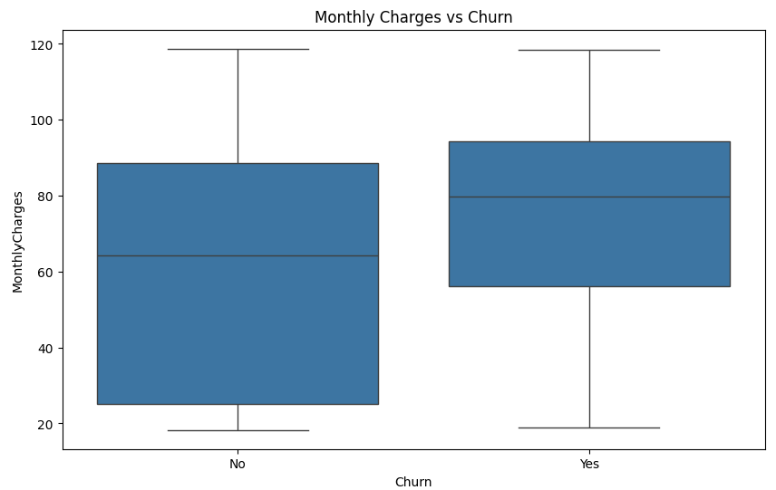
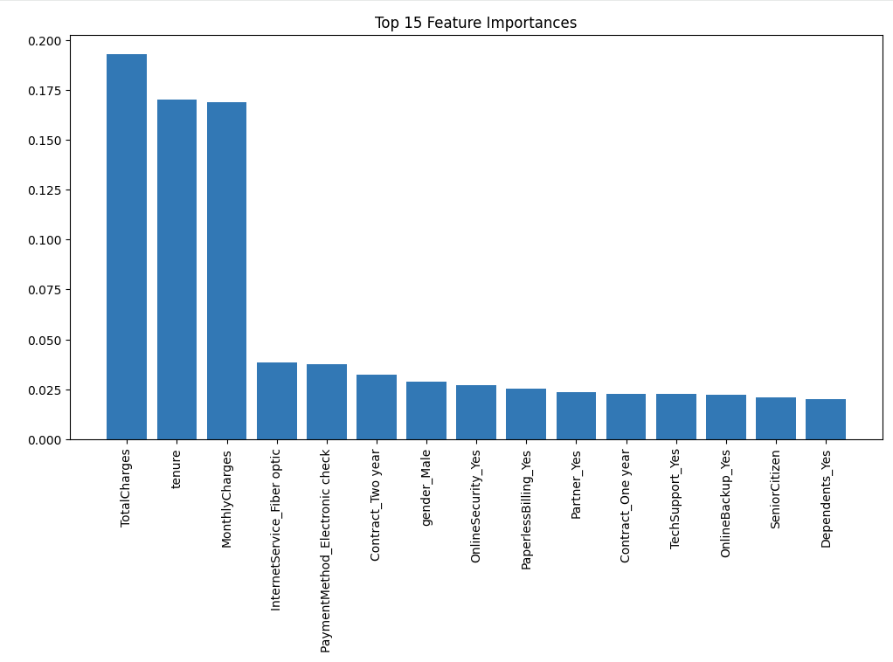

# Customer Churn Prediction & Retention Strategy
Telecommunications (Australia) — Business Analytics Project

# Project Overview
Australian telecommunications companies — including Telstra, Optus, Vodafone and TPG — face persistent customer churn challenges. Customer churn directly impacts recurring revenue and increases acquisition costs.

This project predicts customer churn using the Telco Customer Churn dataset (Kaggle) and provides data-driven strategic recommendations for reducing churn.
The analysis covers:
  1. Customer behaviour patterns
  2. Key churn drivers
  3. Predictive modelling (Logistic Regression & Random Forest)
  4. Retention strategy for high-risk customers

# Business Problem
A mid-sized Australian telecom provider (“AussieConnect”) is experiencing a 26–27% churn rate. 
Leadership wants to:
  1. Understand why customers churn
  2. Identify high-risk customers
  3. Develop targeted retention strategies based on data

# Objectives
  1. Analyse customer demographics, usage behaviour, and service features
  2. Identify key churn predictors
  3. Build churn prediction models
  4. Evaluate performance and trade-offs
  5. Provide actionable business recommendations

# Tools & Techniques
  1. Python (Pandas, NumPy, Seaborn, Matplotlib)
  2. Scikit-Learn (Logistic Regression, Random Forest, Train/Test Split)
  3. One-Hot Encoding & Feature Scaling
  4. EDA & Insight Storytelling
  5. Business Strategy Recommendations

# Exploratory Data Analysis (Key Insights)
   
1️. Churn Distribution
    
    - 26% customers churned
    
    - Indicates class imbalance (typical in churn problems)
    

2️. Churn vs Tenure
     
     - Customers with 0–12 months tenure churn the most
     
     - L0yalty increases significantly after first year

3️. Churn vs Monthly Charges
    
    - High-paying customers churn more
    
    - Price sensitivity is a major driver

    
4️. Churn vs Contract Type
    
    - Month-to-month customers churn 3–4× more
    
    - One-year & two-year contracts strongly reduce churn
    

5️.  Service Features
    
    - Customers WITHOUT the following churn more
    
    - Online Security
    
    - Tech Support
    
    - Device Protection
    
    - These services reduce pain points and increase retention.

  

  # Predictive Models Used

  1. Logistic Regression

     - Baseline explainable model

     - Accuracy: ~80%

     - Lower recall → struggles to capture churners
  
  2. Random Forest

      - Handles non-linear relationships

      - Accuracy: ~80%

      - Much better at identifying churners

      - Provides feature importance

  # Top Churn Drivers (Random Forest Feature Importance)

  1. TotalCharges

  2. Tenure

  3. MonthlyCharges

  4. Fiber Optic Internet

  5. Electronic Check Payment Method

  6. Contract Duration (1-year, 2-year)

  7. Partner / Dependents

  8. TechSupport

  9. OnlineSecurity

  # Business Recommendations

  1. Convert Month-to-Month Customers into Annual Plans

      - Offer discounts for 12-month / 24-month contracts

      - Provide loyalty bonuses (free router upgrades, priority support)

2. Create Pricing Relief Programs

      - High-paying fiber optic users are most likely to churn

      - Bundle discounts or flexible payment plans recommended

3. Improve Payment Experience

   Electronic check users churn more:

     - Promote auto-pay and paperless billing

     - Offer $5 discount for first-time auto-pay enrolment

4. Promote Value-Added Services

   Customers without:

     - TechSupport

     - OnlineSecurity

   churn significantly more.

   Offer:

   - 1-month free TechSupport trial

   - Security package promotions

5. Target High-Risk Customers

   Use churn probability scores to:

   - Send personalised retention offers

   - Prioritise customer service outreach

   - Implement “save” campaigns for predicted churners
  
 # Skills Demonstrated

   - Data Cleaning & Preparation

   - EDA & Insight Storytelling

   - Predictive Modelling

   - Classification Metrics

  - Business Strategy & Communication

  - Model Interpretation

  - End-to-End Analytics Workflow
